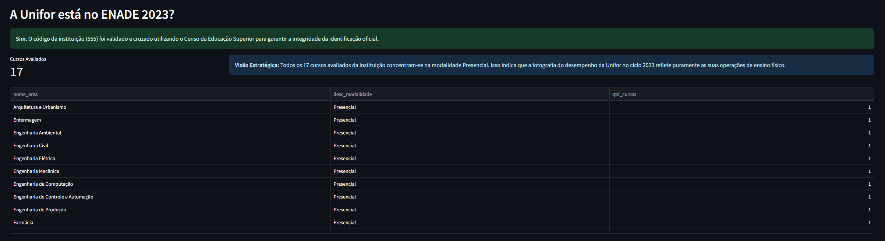
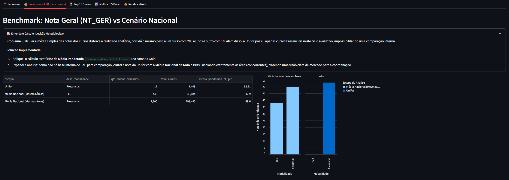
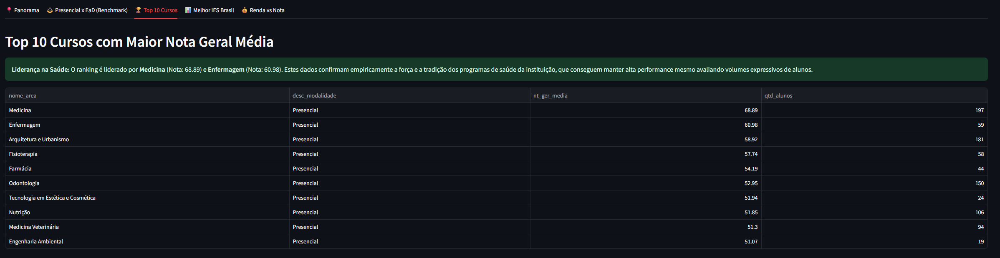
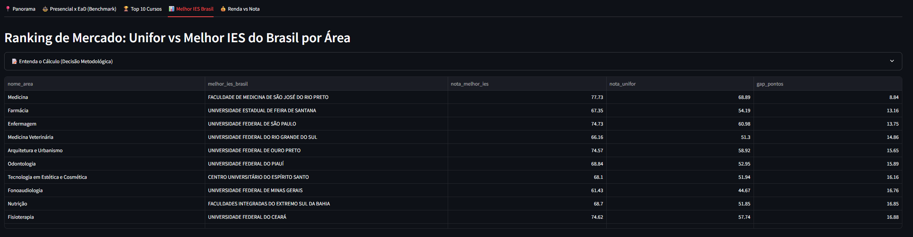
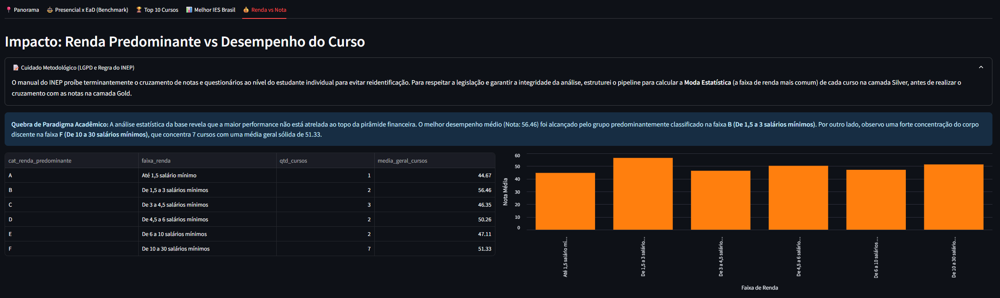

# 🎓 Desafio Técnico - Engenharia de Dados (Unifor)

Este repositório contém a solução ponta a ponta para a ingestão, tratamento, modelagem e visualização dos Microdados do ENADE 2023. O objetivo do projeto é fornecer à Coordenação Acadêmica da Unifor um painel analítico confiável, reprodutível e com regras de negócio claras, garantindo total integridade estatística e respeito à privacidade dos estudantes (LGPD).

---

## 🚀 Como Executar o Projeto (Passo a Passo)

A solução foi 100% conteinerizada. Todo o pipeline (extração, testes, modelagem e dashboard) roda de forma sequencial com um único comando, sem necessidade de instalar bancos de dados ou dependências locais além do Docker.

**Pré-requisitos:** `Docker` e `Docker Compose` instalados e rodando na sua máquina.

1. **Clone este repositório e acesse a pasta:**
```bash
git clone https://github.com/lrodriguesg/desafio-dados-unifor
cd desafio-dados-unifor

```


2. **Execute a orquestração via Docker Compose:**
```bash
docker-compose up --build

```


*Nota: O container executará as camadas Bronze (Download/Fallback), Silver (Pandera/Tratamentos), Gold (dbt run) e, ao finalizar com sucesso, subirá a aplicação.*
3. **Acesse o Dashboard:**
Abra o seu navegador e acesse: **http://localhost:8501**

---

## 🏗️ Arquitetura e Decisões Técnicas

O projeto foi desenhado sob o paradigma da **Arquitetura Medalhão (Bronze, Silver, Gold)**, priorizando leveza, governança e foco em regras de negócio:

* **Motor de Banco de Dados (`DuckDB`):** Escolhido por ser um OLAP in-process de altíssima performance. Permitiu dispensar serviços pesados (como Postgres ou Spark) no Docker, rodando agregações complexas diretamente sobre arquivos `.parquet`.
* **Data Quality (`Pandera`):** Atua como o "fio da navalha" entre as camadas. Foi implementado para validar tipagens, domínios e nulos, impedindo que dados sujos corrompam a camada analítica.
* **Transformação e Semântica (`dbt`):** Utilizado para construir a modelagem dimensional (Star Schema), documentar linhagens e separar as lógicas de BI do banco de dados.
* **Orquestração e Isolamento (`Docker`):** Configurado com um `.dockerignore` estrito e comandos de `dbt clean` para garantir que a compilação seja sempre *stateless* e livre de conflitos de cache.
* **Visualização (`Streamlit`):** Interface puramente Python que lê as *views/tables* já materializadas do DuckDB, garantindo tempo de resposta em milissegundos.

---

## 🛡️ Integridade e Resolução de Anomalias (Diferenciais da Silver)

Bases governamentais costumam apresentar inconsistências. Minha atuação como Engenheiro de Dados focou em garantir a **confiabilidade dos dados** através das seguintes intervenções:

1. **Proteção de Privacidade (Regra INEP/LGPD):** O manual proíbe cruzar bases ao nível do estudante devido ao embaralhamento das linhas. Para resolver isso, estruturei a agregação das notas (`GROUP BY CO_CURSO`) *antes* de realizar cruzamentos, respeitando a lei sem perder poder analítico.
2. **Precisão Matemática (Média Ponderada):** Para calcular notas nacionais e comparativos modais com 100% de precisão agregada, implementei a fórmula `Σ(Nota × Alunos) / Σ(Alunos)`. Isso reconstrói o somatório exato de notas individuais da turma sem descer à granularidade do aluno.
3. **Resiliência e Fallback:** O portal do INEP (Censo Superior) possui instabilidades de WAF/Firewall (erros de `SSLEOFError`). Implementei Spoofing de *User-Agent*, *Retries* e uma função de *Fallback* que gera a Dimensão IES manualmente caso o governo fique fora do ar.
4. **Correção de Dicionário vs Fonte:**
* A variável `CO_MODALIDADE` foi alterada pelo INEP em 2023 de `[1, 2]` para `[0, 1]`. Identifiquei essa anomalia e ajustei o validador do Pandera.
* A variável de Renda consta como `QE_108` no dicionário, mas foi digitada incorretamente como `QE_I08` no arquivo `.txt` oficial. Mapeei e corrigi ativamente no DuckDB durante a ingestão.


---

## ⚙️ Modelo de Dados (Camada Gold)

A modelagem dimensional foi construída via `dbt` e estruturada em um formato Star Schema adaptado para respostas rápidas de BI:

* **Fato:** `fato_performance_cursos` (Métricas agregadas: Notas Gerais imputadas, Quantidade de Alunos).
* **Dimensões:** `dim_cursos` (Categorização por áreas amigáveis), `dim_ies` (Mapeamento institucional dinâmico via Censo).
* **Marts (Business Views):** Views criadas especificamente para responder às perguntas do case (`q1_unifor_overview`, `q2_presencial_vs_ead`, etc.).

---

## 💡 Respostas às Perguntas de Negócio

Todas as respostas estão detalhadas dinamicamente no painel Streamlit. Abaixo, o resumo executivo:

### 1) A Unifor está na base do ENADE?
**Sim.** Através do cruzamento com o Censo da Educação Superior, foi validado que o código da Instituição é **555**. A Unifor possui **17 cursos avaliados** no ciclo de 2023, todos na modalidade **Presencial**.

> 

### 2) A nota geral (NT_GER) difere entre as modalidades (Presencial x EaD)?
Como a Unifor ofertou apenas cursos Presenciais neste ciclo, adaptei a arquitetura para trazer a **Média Nacional** das mesmas áreas para comparação. Utilizando a média ponderada, a Unifor obteve **52.91** no Presencial. 

> 

### 3) Quais os Top 10 Cursos da Instituição?
A liderança de notas da Unifor encontra-se na área da saúde. O primeiro colocado é **Medicina (68.89)**, seguido por **Enfermagem (60.98)** e **Arquitetura e Urbanismo (58.92)**.

> 

### 🌟 Bônus 1: Melhor IES do Brasil nas áreas da Unifor
Utilizando *Window Functions* para calcular o *gap*, nota-se, por exemplo, que em Medicina a Unifor está a apenas **8.84 pontos** da líder nacional (Faculdade de Medicina de São José do Rio Preto - 77.73).

> 

### 🌟 Bônus 2: Relação Renda vs Desempenho
Calculando a "Moda" (renda predominante do curso), verificou-se uma quebra de paradigma: o melhor desempenho médio foi alcançado pelos cursos de faixa **B (1,5 a 3 salários mínimos)** com nota 56.46, embora o maior volume de alunos concentre-se na faixa F (10 a 30 salários).

> 
---

## ⚠️ Limitações Conhecidas e Melhorias Futuras

* **Arquivos Fixos na Camada Bronze:** Devido à natureza da disponibilização do INEP (um `.zip` gigante de 1.8GB), os `.txt` de 2023 foram considerados pré-baixados na pasta `data/bronze/enade`. Uma melhoria futura seria uma orquestração com Airflow para realizar o download assíncrono desses artefatos para um *Data Lake* (S3).
* **Escalabilidade do OLAP:** O DuckDB em modo *in-memory* com exportação Parquet funciona perfeitamente para arquivos da magnitude do ENADE (milhões de linhas). Contudo, para um histórico decenal de dados, a camada Gold beneficiaria de uma migração para AWS Athena ou BigQuery.